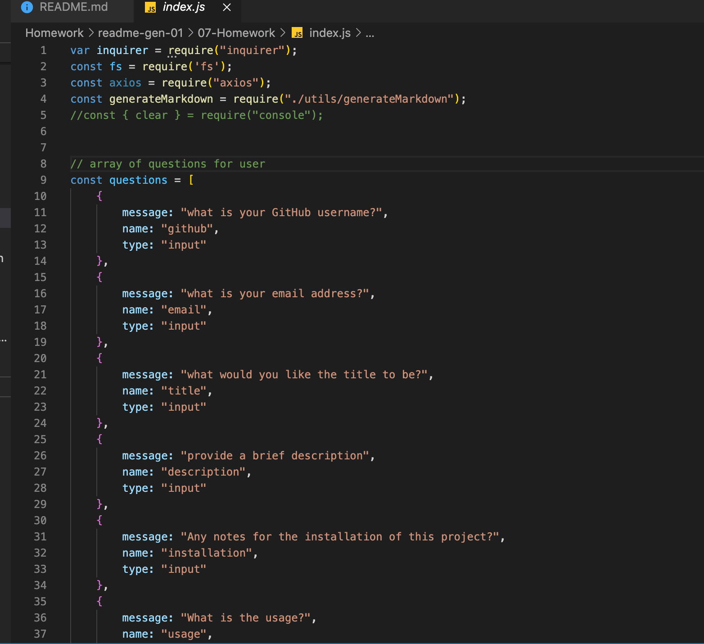

  

# Homework Seven README Generator

---

## Description
For this homework assignment we were tasked with using node.js to generate a **readme** file. This file then would need to appear alongside all of the other files that we had previously created. For this to occur we would need to use the command line to create the readme. An array of questions needs to be made so that the user can follow the prompts provided to then and fill in all the necessary information to create a good readme with __markdown__. Functions need to be generated that can be called on to not only write the file but to also provide the important markdown information that is located on the **generateMarkdown** file.

---

## Table of Contents
* [Description](#description)
* [Installation](#installation)
* [ScreenShots](#screenshots)
* [License](#license)
* [Challenges](#challenges)
* [Gif](#gif)
* [Contact](#contact)

---

## Installation

In order to get this __readme generator__ to work, the first task was to download and install all of the necessary programming information. This meant loading all of the necessary __npm__ and __node.js__ add ons. This was extremely easy especially since we went over ane practiced thus several times during class this week. Each of the packages installed in very little time and with the addition of the __.gitignore__ file, everything was ready for this assignment.

---

## ScreenShots

Here are a few screenshots that I took through this homework assignment:

---

## License

MIT

Licensed under the [MIT License](LICENSE).

---

## challenges
Just like any of our homework assignment, this one did present some unique challenges. The first challenge was getting used to operating exclusively in the command line. Everything up to this point has been __front end__ development so this was a change of pace. The biggest problems I encountered was making sure that my file generation function was being called correctly so that it would build the file and publish it with the others. To solve this I had to go back through some of the exercises that we did this week, where we created new __index.js__ files, and changing a few steps since we wanted to build an entirely new readme without adding a name to it (i.e. alecREADME.md). After going over the examples I was able to make it work, and then the only hurdle that I had left was to get the __generateMarkdown__ file to connect with the information that was being written in the command line. This was more of a time drain, since it meant going back in forth between the two pages to make sure that all the naming conventions matched up.

---

## Gif

Here is the README.md Generator in action:

---

## Contact

If you would like to contact me:

GitHub: [Arewinkl](https://github.com/arewinkl)

Email: alecrewinkel@gmail.com

